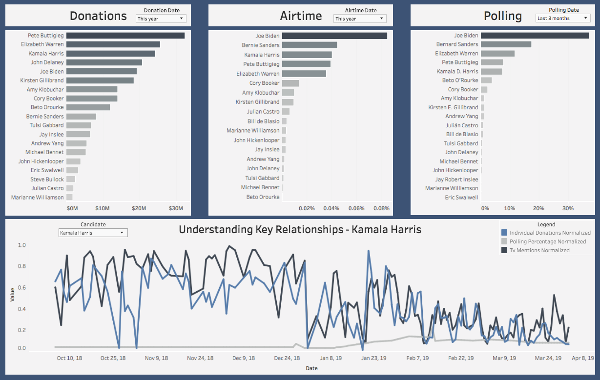

This post will provide a walkthrough of our visualizations and how a user can better gather insight from our product.

### Main Dashboard
{:height="200px" width="300px"}  

#### Donations
This section provides a ranking of candidates by donations they have received. The data for this is retrieved from the Federal Election Commission (FEC) website. They provide quarterly updates that allow us to understand how are candidate is performing relative to the other candidates in the field. The default date range is selected for this current year but can be updated by the user to any time frame. To get more information on your candidate, hover over his/her bar and select to drill down.

#### Airtime
Airtime data is retrieved from the GDELT TV API which is a platform that takes 15 second clips from news and extracts the words that were mentioned during that clip. This allows us to record how often each candidate is talked about. Once again, the default date range is set to this year, but it can be adjusted based off the date range you are interested in viewing. To get more detailed data on which network talks about the candidate the most, hover over their bar and select.

#### Polling
Polling data is collected from FiveThirtyEight which compiles polling results from the major pollsters. This graphic then ranks how well each candidate is performing on average in the polls relative to their opponents. The default date range is selected for the last 3 months but can be adjusted based off the users specifications. Once again, to drill down, hover over the bar and select.

### Another header!

tk

### Methodology

tk
