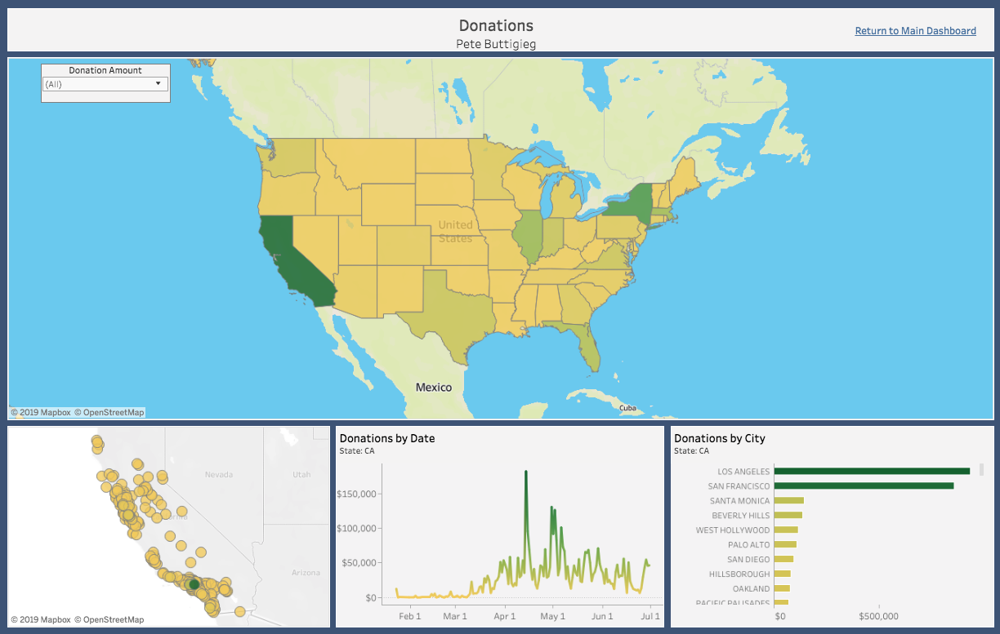
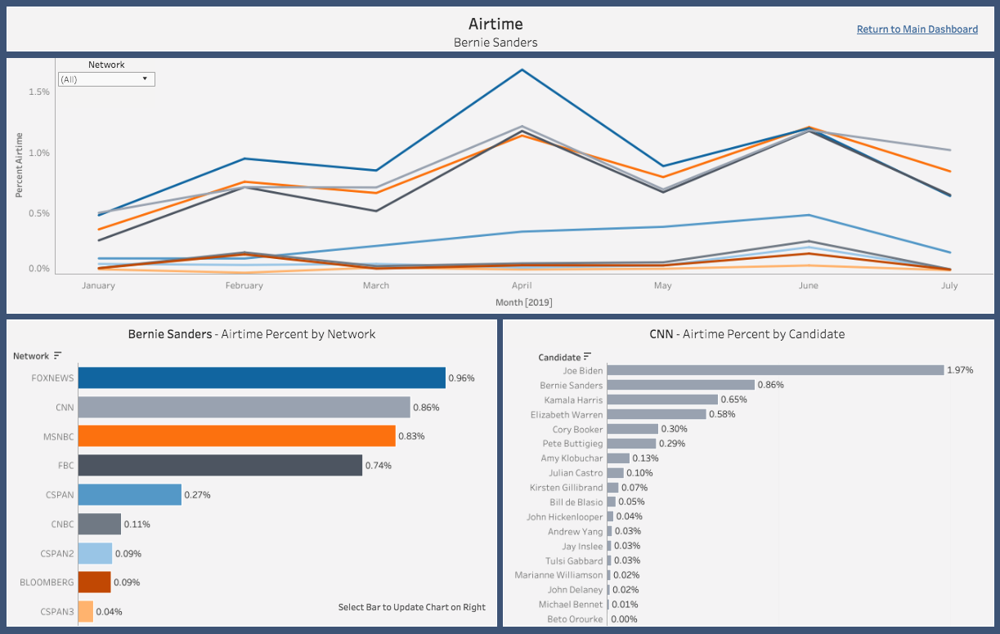
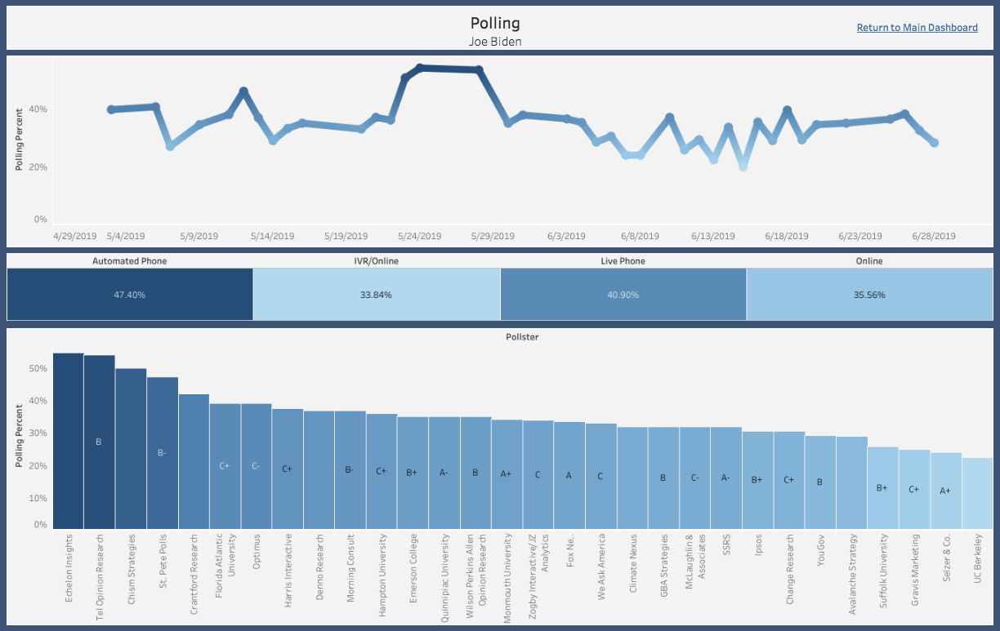

This post will provide a walkthrough of our visualizations and how a user can better gather insight from our product.

## Main Dashboard
  

##### Donations (Top Left Chart)
This section provides a ranking of candidates by donations they have received. The data for this is retrieved from the Federal Election Commission (FEC) website. They provide quarterly updates that allow us to understand how are candidate is performing relative to the other candidates in the field. The default date range is selected for this current year but can be updated by the user to any time frame. To get more information on your candidate, hover over his/her bar and select to drill down.

##### Airtime (Top Middle Chart)
Airtime data is retrieved from the GDELT TV API which is a platform that takes 15 second clips from news and extracts the words that were mentioned during that clip. This allows us to record how often each candidate is talked about. Once again, the default date range is set to this year, but it can be adjusted based off the date range you are interested in viewing. To get more detailed data on which network talks about the candidate the most, hover over their bar and select.

##### Polling (Top Right Chart) 
Polling data is collected from FiveThirtyEight which compiles polling results from the major pollsters. This graphic then ranks how well each candidate is performing on average in the polls relative to their opponents. The default date range is selected for the last 3 months but can be adjusted based off the users specifications. Once again, to drill down, hover over the bar and select.

##### Understanding Key Relationships (Bottom Chart)
One of the challenges associated with visualizing multiple different key metrics is understanding how they relate to one another. This chart normalizes the data associated with donations, airtime and polling and plots them together over a given date range. A user can then select a certain candidate and get a better idea which of the key metrics are related to each other.

## Donation Dashboard
{:height="200px" width="300px"}  

##### United States Map (Top Chart)
The US map provides a high level view of how much money the candidate you have selected has raised in each state. The darker the green, the more money they have raised. The lighter yellow means the less money they have raised. The "Donation Amount" filter in the upper left allows the user to select only Small (<$200) or Large (>$200) donations depending on what they are interested in learning more about. To view the details of an individual state, hover over that state and select to update the state map chart on the bottom left.

##### State Map (Bottom Left Chart)
The state map chart defaults on California. This map plots out the donations on a map of the selected state and the color of the circle shows how much money each city has donated to the candidate (darker green = more money, light yellow = less money). Hover over each circle to see how much a given city has donated.

##### Donations by Date (Bottom Middle Chart)
This chart provides a user with information of how much the selected state has donated to the candidate since the beginning of Q1. It provides us information if the candidate is trending in a positive or negative direction in this state or if all their donations are because of a few days.

##### Donations by City (Bottom Right Chart)
Donations by city provide the user with a different view of looking at the state map chart. The state map chart is more focused on the geographic location of a given donation while donations by city charts the cities with the most donations at the top so it easier to understand where the donations are coming from.

## Airtime Dashboard
{:height="200px" width="300px"}  

##### Airtime by Month (Top Chart)
The time series provides a view by network of how much airtime the selected candidate it getting each month. This allows the user to see if their candidate is trending in the right direction by receiving more airtime from networks. It also helps to better understand why they had certain peaks in airtime percent.

##### Airtime by Network (Bottom Left Chart)
This chart aggregates the data from above into a number that can be used to rank which networks have devoted the most airtime to the selected candidate. From here, the user can select a given network bar and have the chart on the right update to display the network.

##### Airtime by Candidate (Bottom Right Chart)
Based off what network the user has selected from the chart on the left, the airtime by candidate chart will provide the user with the ranking of candidates for the selected network. The user can then determine where their candidate falls in the overall ranking of that network.

## Polling Dashboard
{:height="200px" width="300px"}  

##### Polling Percent by Date (Top Chart)
This displays the polling percentage for the given candidate based off the date range selected in the main dashboard. This allows the user to see the trend of how their candidate is polling and allows them to dive deeper into any spikes or dips.

##### Polling Percent by Pollster (Bottom Chart)
Each pollster has an average polling percentage for the given candidate so the user can understand the distribution of percentages. FiveThirtyEight has also provided a grade for each pollster based off how they polled in the 2016 election so the user can understand where the reputable polls are placing their candidate.
