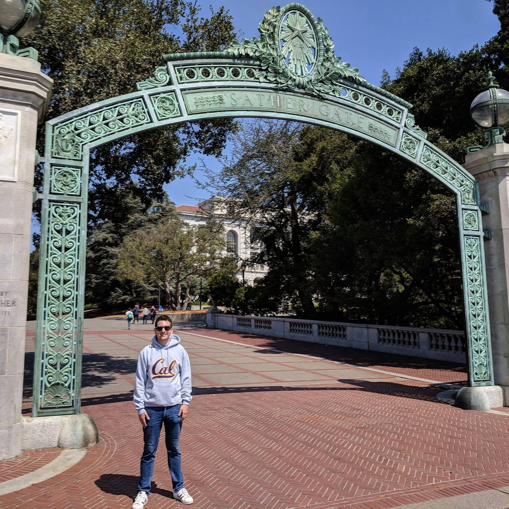

---
title: About Us
layout: template
filename: about
--- 

# About Our Team

{:height="400px" width="300px"}  
**Andrew Walters**  
Andrew Walters is a Data Scientist working on Supply Chain Affordability at Lockheed Martin in the Greater Philadelphia Area. He is working on his Master's in Information and Data Science at Berkeley as part of Lockheed's Engineering Leadership Development Program. He will graduate both programs this August. Previously Andrew earned a Bachelors Degree in Computer Engineering and Computer Science at Villanova University.
 

{:width="300px"}  
**Cyprian Gascoigne**  
Cyprian is a data scientist working in consumer credit and lending. He will graduate from Berkeley's with a Masters in Data Science in August 2019. Previously he studied Mathematics at the University of Washington.
 

{:height="225px" width="300px"}  
**Kanitha Mann**  
Kanitha Mann is a data scientist working for a start up in the healthcare industry. She earned a Bachelor’s degree in Mechanical Engineering from Georgia Tech and is excited to soon earn a Master's in Information and Data Science. Kanitha lives in Atlanta with her husband, Tony, and their nine year old boxer mix, Sadie.
 

{:height="200px" width="300px"}  
**Matt Vay**  
Matt currently lives in Seattle, WA with his wife, Emily. He graduated from the University of Washington with a degree in Industrial & Systems Engineering and began working for Boeing. After becoming interested in the growing industry of big data, Matt decided to pursue a degree in MIDS.

