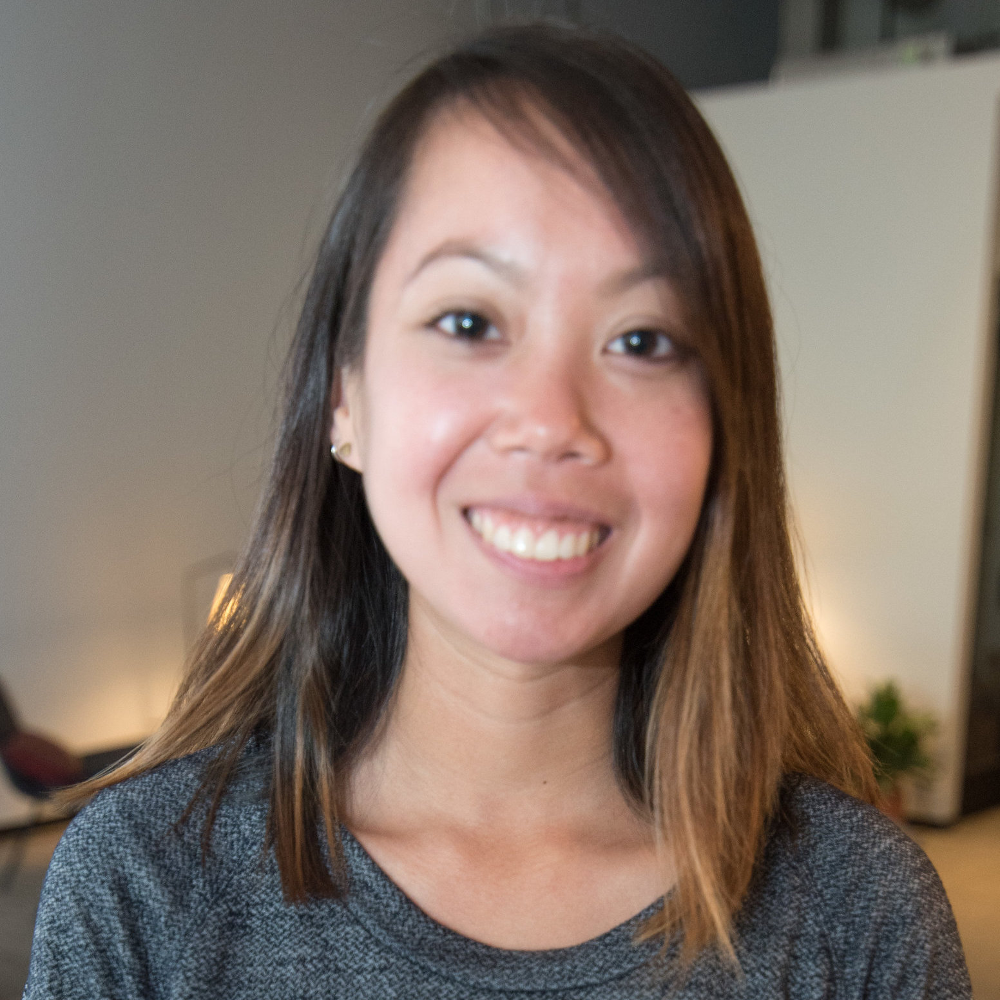
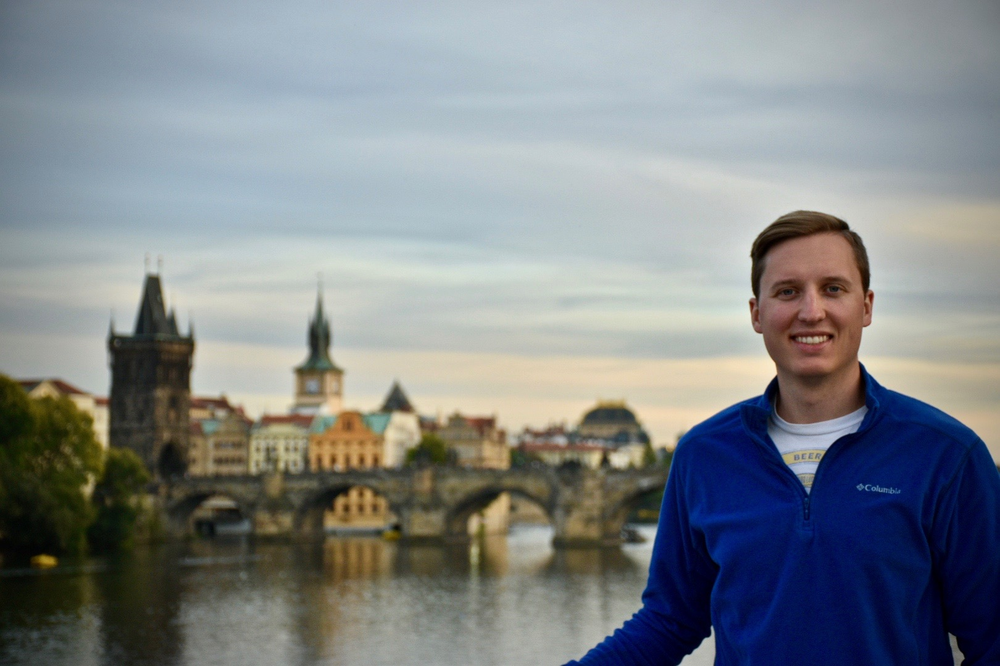

---
title: About Us
layout: template
filename: about
--- 

# About Our Team

{:height="200px" width="300px"}  
**Andrew Walters**  
A few sentences about Andrew
 

{:height="200px" width="300px"}  
**Cyprian Gascoigne**  
A few sentences about Cyprian
 

{:height="225px" width="300px"}  
**Kanitha Mann**  
Kanitha Mann is a data scientist working for a start up in the healthcare industry. She earned a Bachelor’s degree in Mechanical Engineering from Georgia Tech and is excited to soon earn a Master's in Information and Data Science. Kanitha lives in Atlanta with her husband, Tony, and their nine year old boxer mix, Sadie.
 

{:height="200px" width="300px"}  
**Matt Vay**  
Matt currently lives in Seattle, WA with his wife, Emily. He graduated from the University of Washington with a degree in Industrial & Systems Engineering and began working for Boeing. After becoming interested in the growing industry of big data, Matt decided to pursue a degree in MIDS.

